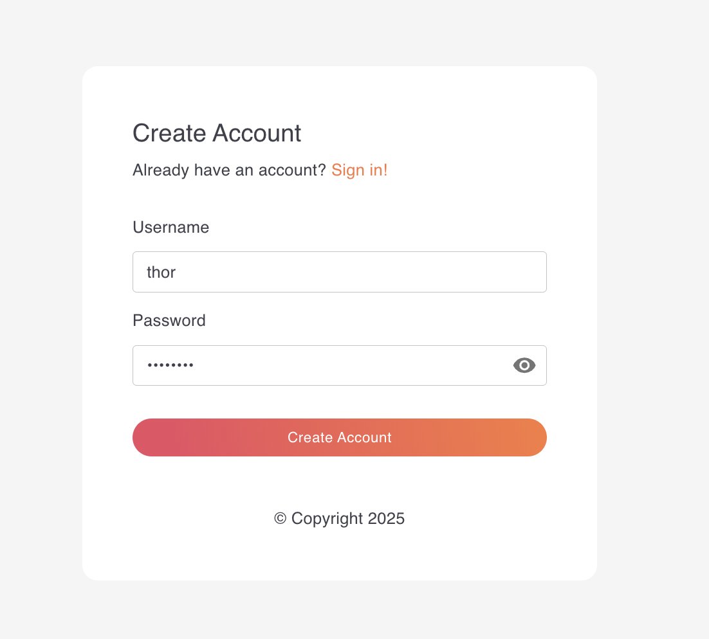
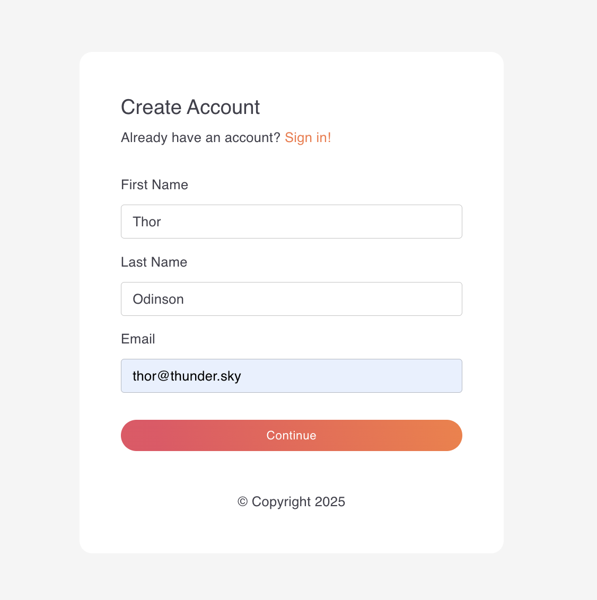
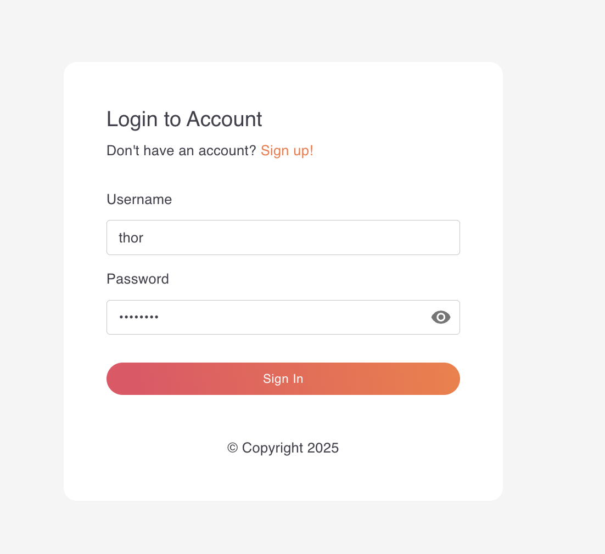

# WSO2 Thunder ⚡

### Identity Management Suite

[](https://opensource.org/licenses/Apache-2.0)
[](https://github.com/asgardeo/thunder/commits/main)
[](https://github.com/asgardeo/thunder/issues)
[](https://codecov.io/github/asgardeo/thunder?branch=main)

Thunder is a modern, open-source identity management service designed for teams building secure, customizable authentication experiences across applications, services, and AI agents. It enables developers to design and orchestrate login, registration, and recovery flows using a flexible identity flow designer.

Designed for extensibility, scalability, and seamless containerized deployment, Thunder integrates naturally with microservices and DevOps environments—serving as the core identity layer for your cloud platform.

---

## 🚀 Features

- **Standards-Based**
  - OAuth 2/ OpenID Connect (OIDC): Client Credentials, Authorization Code, Refresh Token
- **Login Options:**
  - Basic Authentication (Username/Password)
  - Social Logins: Google, Github
  - SMS OTP
- **Registration Options:**
  - Username/Password
  - Social Registration: Google, Github
  - SMS OTP
- **RESTful APIs:**
  - App Native Login/Registration
  - User Management
  - Application Management
  - Identity Provider Management
  - Message Notification Sender Management

---

## ⚡ Quickstart

This Quickstart guide will help you get started with WSO2 Thunder quickly. It walks you through downloading and running the product, trying out the sample app, and exploring registering a user, logging in, and using the Client Credentials flow.

### Download and Run WSO2 Thunder

You can run WSO2 Thunder either by downloading the release artifact or using the official Docker image.

#### Option 1: Run from Release Artifact

Follow these steps to download the latest release of WSO2 Thunder and run it locally.

1. **Download the distribution from the latest release**

    Download `thunder-<version>-<os>-<arch>.zip` from the [latest release](https://github.com/asgardeo/thunder/releases/latest) for your operating system and architecture.

    For example, if you are using a MacOS machine with a Apple Silicon (ARM64) processor, you would download `thunder-<version>-macos-arm64.zip`.

2. **Unzip the product**

    Unzip the downloaded file using the following command:

    ```bash
    unzip thunder-<version>-<os>-<arch>.zip
    ```

    Navigate to the unzipped directory:

    ```bash
    cd thunder-<version>-<os>-<arch>/
    ```

3. **Start the product**

    Start the product using the following command:

    If you are using a Linux or macOS machine:

    ```bash
    bash start.sh --setup
    ```

    If you are using a Windows machine:

    ```powershell
    .\start.ps1 --setup
    ```

> [!TIP]
> The `--setup` flag initializes the product with default configurations, including creating an admin user and the Develop application.
> You can omit this flag if you have already set up the initial data.
> You can also run the setup manually later using the script located at:
>   - **Linux/macOS**: `<THUNDER_HOME>/scripts/setup_initial_data.sh`
>   - **Windows**: `<THUNDER_HOME>\scripts\setup_initial_data.ps1`

#### Option 2: Run with Docker

Follow these steps to run WSO2 Thunder using Docker.

1. **Pull the Docker image**

    ```bash
    docker pull ghcr.io/asgardeo/thunder:latest
    ```

2. **Run the container**

    ```bash
    docker run --rm \
      -p 8090:8090 \
      ghcr.io/asgardeo/thunder:latest
    ```

    Optionally if you want to modify the server configurations, you can mount a custom `deployment.yaml` file. Create a `deployment.yaml` file in your working directory similar to the [deployment.yaml](https://github.com/asgardeo/thunder/blob/main/backend/cmd/server/repository/conf/deployment.yaml), and mount it as below:

    ```bash
    docker run --rm \
      -p 8090:8090 \
      -v $(pwd)/deployment.yaml:/opt/thunder/repository/conf/deployment.yaml \
      ghcr.io/asgardeo/thunder:latest
    ```

    Optionally if you want to use custom configurations or certificates, you can mount them as follows:

    ```bash
    docker run --rm \
      -p 8090:8090 \
      -v $(pwd)/deployment.yaml:/opt/thunder/repository/conf/deployment.yaml \
      -v $(pwd)/certs/server.cert:/opt/thunder/repository/resources/security/server.cert \
      -v $(pwd)/certs/server.key:/opt/thunder/repository/resources/security/server.key \
      ghcr.io/asgardeo/thunder:latest
    ```

3. **Initialize with default data (Required for first-time setup)**

    To use the Developer Console and sample applications, you need to set up initial data including the default admin user. Run this command after starting the container:

    ```bash
    docker exec -it $(docker ps -q --filter ancestor=ghcr.io/asgardeo/thunder:latest) \
      /opt/thunder/scripts/setup_initial_data.sh
    ```

    This creates:
    - Default admin user (`admin` / `admin`)  
    - Developer Console application
    - Basic authentication and registration flows

    > [!NOTE]
    > Replace the container selection with your specific container name if running multiple Thunder containers.

### Try Out the Product

#### Try out the Developer Console

Follow these steps to access the Developer Console:

1. Open your browser and navigate to [https://localhost:8090/develop](https://localhost:8090/develop).

2. Log in using the admin credentials created during the initial data setup (`admin` / `admin`).

#### Try Out with the Sample App

To quickly get started with Thunder, you can use the sample app provided with the product. This guide demonstrates how to download and run the sample app, self register a user and try out login to the sample app.

##### Download and Run the Sample App

1. Download the sample app from the latest release

    Download `sample-app-<version>-<os>-<arch>.zip` from the [latest release](https://github.com/asgardeo/thunder/releases/latest) for your operating system and architecture.

2. Unzip and navigate to the sample app directory

    ```bash
    unzip sample-app-<version>-<os>-<arch>.zip
    cd sample-app-<version>-<os>-<arch>/
    ```

3. **Create required application for sample app in Thunder**

    Before using the sample app, you need to create an application in Thunder:

    ```bash
    curl -kL -X POST -H 'Content-Type: application/json' -H 'Accept: application/json' https://localhost:8090/applications \
    -d '{
        "name": "Sample App",
        "description": "Sample application for testing",
        "url": "https://localhost:3000",
        "logo_url": "https://localhost:3000/logo.png",
        "tos_uri": "https://localhost:3000/terms",
        "policy_uri": "https://localhost:3000/privacy",
        "contacts": ["admin@example.com", "support@example.com"],
        "auth_flow_graph_id": "auth_flow_config_basic",
        "registration_flow_graph_id": "registration_flow_config_basic",
        "is_registration_flow_enabled": true,
        "user_attributes": ["given_name","family_name","email","groups"],
        "inbound_auth_config": [{
            "type": "oauth2",
            "config": {
                "client_id": "sample_app_client",
                "client_secret": "sample_app_secret",
                "redirect_uris": ["https://localhost:3000"],
                "grant_types": ["authorization_code", "client_credentials"],
                "response_types": ["code"],
                "token_endpoint_auth_method": "client_secret_basic",
                "pkce_required": false,
                "public_client": false,
                "scopes": ["openid", "profile", "email"],
                "token": {
                    "issuer": "thunder",
                    "access_token": {
                        "validity_period": 3600,
                        "user_attributes": ["given_name","family_name","email","groups"]
                    },
                    "id_token": {
                        "validity_period": 3600,
                        "user_attributes": ["given_name","family_name","email","groups"],
                        "scope_claims": {
                            "profile": ["name","given_name","family_name","picture"],
                            "email": ["email","email_verified"],
                            "phone": ["phone_number","phone_number_verified"],
                            "group": ["groups"]
                        }
                    }
                }
            }
        }]
    }'
    ```

    Note the `id` from the response - you'll need it for the sample app configuration.

4. **Configure the sample app**

    Open the `runtime.json` file in the thunder-sample-app-<version>-<os>-<arch>/app directory and update the configurations:
    - `applicationID`: Use the application ID from step 3
    - `flowEndpoint`: The root endpoint for the flow execution API (default: `https://localhost:8090/flow`)

5. **Start the sample app**

    ```bash
    sh start.sh
    ```

Open your browser and navigate to [https://localhost:3000](https://localhost:3000) to see the sample app in action.

##### Self Register a User

To self register a user in the sample app, follow these steps:

1. Open the sample app in your browser at [https://localhost:3000](https://localhost:3000) and click on the "Sign up" button.

2. Provide a username and password for the new user and click on the "Create Account" button.

    

3. Fill in the additional user attributes such as first name, last name and email address. Click "Continue" to complete the registration.

    

4. After successful registration, you will be automatically logged in to the sample application.

##### Login to the Sample App

To log in to the sample app, follow these steps:

1. Open the sample app in your browser at [https://localhost:3000](https://localhost:3000).

2. Enter username and password you used during the self registration process and click on the "Sign In" button.

    

3. If the login is successful, you will be redirected to the home page of the sample app with the access token.

#### Try Out Client Credentials Flow

The Client Credentials flow is used to obtain an access token for machine-to-machine communication. This flow does not require user interaction and is typically used for server-to-server communication.

To try out the Client Credentials flow, follow these steps:

1. Create a Client Application

   Create a client application in the system to use for the Client Credentials flow. You can use the following cURL command to create a new application.

    ```bash
    curl -kL -X POST -H 'Content-Type: application/json' -H 'Accept: application/json' https://localhost:8090/applications \
    -d '{
        "name": "Test Sample App",
        "description": "Initial testing App",
        "auth_flow_graph_id": "auth_flow_config_basic",
        "inbound_auth_config": [
            {
                "type": "oauth2",
                "config": {
                    "client_id": "<client_id>",
                    "client_secret": "<client_secret>",
                    "redirect_uris": [
                        "https://localhost:3000"
                    ],
                    "grant_types": [
                        "client_credentials"
                    ],
                    "token_endpoint_auth_method": "client_secret_basic",
                    "pkce_required": false,
                    "public_client": false,
                    "scopes": ["api:read", "api:write"]
                }
            }
        ]
    }'
    ```

2. Obtain an Access Token

   Use the following cURL command to obtain an access token using the Client Credentials flow. Make sure to replace the `<client_id>` and `<client_secret>` with the values you used when creating the client application.

    ```bash
    curl -k -X POST https://localhost:8090/oauth2/token \
      -d 'grant_type=client_credentials' \
      -u '<client_id>:<client_secret>'
    ```

---

<details>
<summary><h2>🛠️ Build the Product from Source</h2></summary>

### Prerequisites

- Go 1.25+
- Node.js 24+

---

- Build the product with tests using the following command:

    ```bash
    make all
    ```

</details>

---

<details>
<summary><h2>⚙️ Development Setup</h2></summary>

### Prerequisites

- Go 1.24+
- Node.js 24+

### Start Thunder in Development Mode

- Clone the repository:

    ```bash
    git clone https://github.com/asgardeo/thunder
    cd thunder
    ```

- Run the following command to start the product in development mode:

    ```bash
    make run
    ```

- The product will start on `https://localhost:8090`.

### Start the Sample App in Development Mode

- Navigate to the sample app directory:

  ```bash
  cd samples/apps/oauth
  ```

- Create a file `.env` in the path `samples/apps/oauth/` and add below values.

  ```
  VITE_REACT_APP_SERVER_FLOW_ENDPOINT=https://localhost:8090/flow
  VITE_REACT_APPLICATIONS_ENDPOINT=https://localhost:8090/applications
  VITE_REACT_APP_AUTH_APP_ID={your-application-id}
  VITE_REACT_APP_REDIRECT_BASED_LOGIN=false
  ```

- Install the dependencies:

  ```bash
  npm install
  ```

- Run the sample app using the following command:

  ```bash
  npm run dev
  ```
  
- Open your browser and navigate to `http://localhost:3000` to see the sample app in action.

### Remote Debugging Setup

Thunder supports remote debugging using Delve debugger, enabling debugging from any IDE that supports the Debug Adapter Protocol (DAP).

#### Install Delve Debugger

Install Delve using Go:

```bash
go install github.com/go-delve/delve/cmd/dlv@latest
```

Add Delve to your PATH:

```bash
export PATH=$PATH:$(go env GOPATH)/bin
```

#### Start Thunder in Debug Mode

From the distribution directory:

**Linux/macOS:**

```bash
./start.sh --debug
```

**Windows (PowerShell):**

```powershell
.\start.ps1 --debug
```

**Windows (Command Prompt):**

```cmd
start.bat --debug
```

The debugger will listen on `localhost:2345` by default.

#### Connect from IDE

**VS Code:**
- Use the provided `.vscode/launch.json` configuration
- Press `F5` or go to `Run and Debug`

**GoLand/IntelliJ:**
- Go to `Run → Edit Configurations → + → Go Remote`
- Set Host: `127.0.0.1`, Port: `2345`

**Other IDEs:**
- Configure DAP client to connect to `127.0.0.1:2345`

### Testing

Thunder includes both unit tests and integration tests:

#### Run Unit Tests

```bash
make test_unit
```

#### Run Integration Tests

```bash
make test_integration
```

**Note:** This command will run integration tests on an already built product. If you need to build the product before running integration tests, use:

```bash
make build_backend test_integration
```

#### Run Tests with Coverage

```bash
make build_with_coverage
```

This will build the server with coverage instrumentation, run tests, and generate coverage reports at `target/` directory.

</details>

---

<details>
<summary><h2>🔧 Advanced Setup & Configuration</h2></summary>

<details>
<summary><h3>Running with PostgreSQL Database</h3></summary>

#### Step 1: Start and Initialize PostgreSQL

1. Navigate to local-development directory

```bash
cd install/local-development
```

2. Start PostgreSQL Database in background

```bash
docker compose up -d 
```

3. View PostgreSQL Database logs

```bash
docker compose logs -f
```

4. Stop PostgreSQL Database

```bash
docker compose down
```

- Stop PostgreSQL Database and delete all data 

```bash
docker compose down -v
```

#### Step 2: Configure Thunder to Use PostgreSQL

1. Open the `backend/cmd/server/repository/conf/deployment.yaml` file.
2. Update the `database` section to point to the PostgreSQL database:

    ```yaml
    database:
        identity:
            type: "postgres"
            hostname: "localhost"
            port: 5432
            name: "thunderdb"
            username: "asgthunder"
            password: "asgthunder"
            sslmode: "disable"
        runtime:
            type: "postgres"
            hostname: "localhost"
            port: 5432
            name: "runtimedb"
            username: "asgthunder"
            password: "asgthunder"
            sslmode: "disable"
    ```

#### Step 3: Run the Product

   ```bash
   make run
   ```

The product will now use the PostgreSQL database for its operations.

</details>

</details>

---

## Star History

[](https://www.star-history.com/#asgardeo/thunder&type=date&legend=top-left)

## 🤝 Contributing

Please refer to the [CONTRIBUTING.md](./CONTRIBUTING.md) for guidelines on how to contribute to this project.

## License

Licenses this source under the Apache License, Version 2.0 ([LICENSE](LICENSE)), You may not use this file except in compliance with the License.

---------------------------------------------------------------------------
(c) Copyright 2025 WSO2 LLC.
