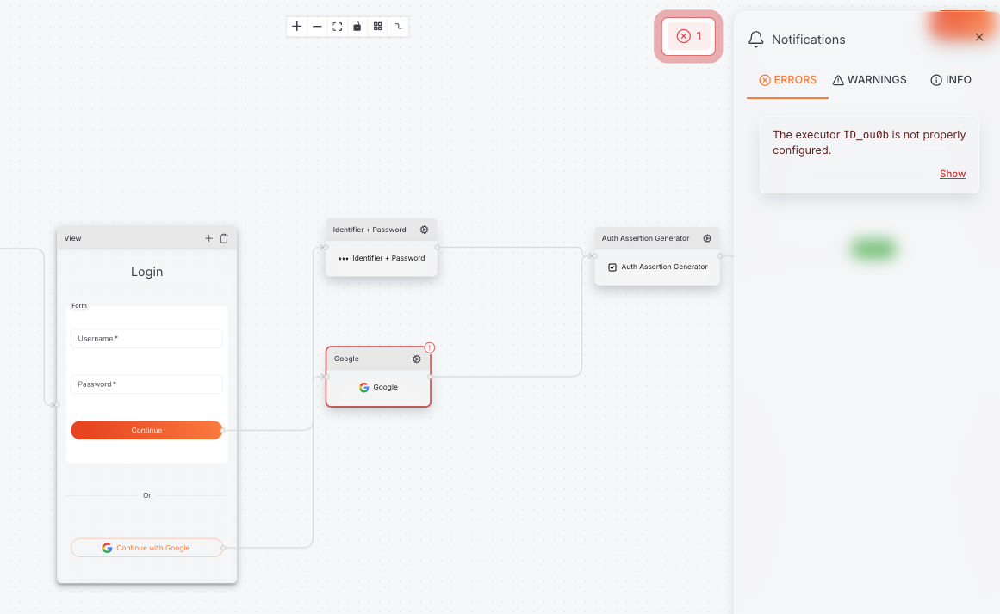

# Flow Creation Guide

This guide explains how to create flows in Thunder using the Visual Flow Builder or Flow Management API.

## Understanding Flows

Flows are node-based graphs that control user interaction and backend processing. Each flow consists of:

- **Nodes**: Individual steps (prompts, executors, decisions)
- **Edges**: Connections defining the flow path
- **Actions**: User-triggered navigation between nodes

### Flow Types

| Type | Description |
|------|-------------|
| AUTHENTICATION | User login flows |
| REGISTRATION | User registration/signup flows |

---

## Creating Flows with Visual Flow Builder

The Develop App includes a visual flow builder for designing flows through a drag-and-drop interface.

### Canvas Overview


The flow builder canvas provides a visual workspace where you can design your flows. The left panel contains available resources (widgets, steps, components, executors) that can be dragged onto the canvas. Steps are connected by edges that define the flow path.

### Configuring Execution Properties


Select a task execution step on the canvas to configure its properties in the right panel. Properties vary by executor type - for example, social login executors require an `idpId`, while SMS OTP executors require a `senderId`.

### Flow Validation



The validation panel shows errors and warnings in your flow. All validation issues must be resolved before saving. Common issues include missing connections, required properties, and invalid node configurations.

---

## Creating Flows via API

Use the Flow Management API to create flows programmatically. Following are the key fields that need to be provided when creating a flow.

- `name`: Display name for the flow
- `handle`: Unique identifier within a flow type. Two different flow types can share the same handle.
- `flowType`: Type of the flow, either `AUTHENTICATION` or `REGISTRATION`
- `nodes`: Array of node definitions that make up the flow

### Create a Flow

```bash
curl -X POST https://localhost:8090/flows \
  -H 'Content-Type: application/json' \
  -H 'Authorization: Bearer <token>' \
  -d '{
    "name": "My Authentication Flow",
    "handle": "my-auth-flow",
    "flowType": "AUTHENTICATION",
    "nodes": [...]
  }'
```

Refer to the [Flow Management API](/api/flow-management.yaml) for the complete schema.

---

## Node Types

### START

Entry point of the flow. Required in all flows. Start node must have a single `onSuccess` edge to the next node.

```json
{
  "id": "start",
  "type": "START",
  "onSuccess": "next_node"
}
```

### PROMPT

Interactive UI screen that collects user input and displays actions. Contains optional `meta` for UI components (used by Visual Flow Builder and login SDK).

Prompt node must have at least one action that defines navigation to the next node.

```json
{
  "id": "login_prompt",
  "type": "PROMPT",
  "inputs": [
    { 
      "identifier": "username", 
      "type": "TEXT_INPUT", 
      "required": true 
    },
    { 
      "identifier": "password", 
      "type": "PASSWORD_INPUT", 
      "required": true 
    }
  ],
  "actions": [
    { 
      "ref": "submit_action", 
      "nextNode": "auth_node" 
    }
  ]
}
```

### TASK_EXECUTION

Backend executor that performs authentication, provisioning, or other tasks. Must define an `executor` with `name` and optional `properties`. Also must define `onSuccess` and optional `onFailure` edges.

```json
{
  "id": "basic_auth",
  "type": "TASK_EXECUTION",
  "executor": {
    "name": "SMSOTPAuthExecutor",
    "mode": "verify"
  },
  "properties": {
    "senderId": "<sender-uuid>"
  },
  "onSuccess": "next_node",
  "onFailure": "error_node"
}
```

### END

Terminal node indicating flow completion.

```json
{
  "id": "end",
  "type": "END"
}
```

## Meta Components

Meta components define the UI for PROMPT nodes. These are returned when executing flows in verbose mode and are utilized by the Visual Flow Builder and login SDK to create step representations.

### Input Fields

| Type | Description |
|------|-------------|
| TEXT_INPUT | Text input field |
| PASSWORD_INPUT | Password field (masked) |
| EMAIL_INPUT | Email input |
| PHONE_INPUT | Phone number input |
| NUMBER_INPUT | Numeric input |
| DATE_INPUT | Date picker |
| OTP_INPUT | OTP code input |
| CHECKBOX | Boolean checkbox |
| DROPDOWN | Selection dropdown |

### Display Elements

| Type | Description |
|------|-------------|
| TEXT | Text label |
| RICH_TEXT | Formatted text content |
| DIVIDER | Visual separator |
| IMAGE | Image display |

### Actions

| Variant | Description |
|---------|-------------|
| PRIMARY | Main action button |
| SECONDARY | Secondary action |
| SOCIAL | Social login button |
| TEXT | Text link action |

### Containers

| Type | Description |
|------|-------------|
| BLOCK | Groups components together |

---

## Executors

Executors perform backend logic in TASK_EXECUTION nodes.

| Executor | Description | Properties | Required | Flow Types |
|----------|-------------|------------|----------|------------|
| UserTypeResolver | Resolves user type and OU for registration. **Must be placed after START node** in registration flows. | None | Yes | Registration |
| BasicAuthExecutor | Attribute + credential authentication. Use any identifying attribute (username, email, phone) plus a credential. | None | No | Authentication, Registration |
| GoogleOIDCAuthExecutor | Google social login via OIDC. | `idpId` | No | Authentication, Registration |
| GithubOAuthExecutor | GitHub social login via OAuth. | `idpId` | No | Authentication, Registration |
| OAuthExecutor | Generic OAuth2 social login. | `idpId` | No | Authentication, Registration |
| OIDCAuthExecutor | Generic OIDC social login. | `idpId` | No | Authentication, Registration |
| SMSOTPAuthExecutor | SMS OTP authentication. Requires `mode` in executor and `senderId` in properties. | `senderId` | No | Authentication, Registration |
| AuthorizationExecutor | Evaluates user authorization based on requested permissions. | None | No | Authentication |
| AuthAssertExecutor | Generates JWT assertion for authenticated user. Required at the end of authentication flows. Optional in registration flows for auto-login. | None | Yes (Auth) | Authentication, Registration |
| AttributeCollector | Collects additional attributes and updates user profile after authentication. | None | No | Authentication |
| ProvisioningExecutor | Creates new user account in the system. Required at the end of registration flows. | None | Yes | Registration |
| OUExecutor | Optionally create organization units during registration flows. | None | No | Registration |

### Executor Modes

Some executors support different modes specified in the executor configuration:

```json
{
  "executor": {
    "name": "SMSOTPAuthExecutor",
    "mode": "send"
  }
}
```

| Executor | Available Modes | Description |
|----------|-----------------|-------------|
| SMSOTPAuthExecutor | `send`, `verify` | `send` initiates OTP delivery, `verify` validates user-provided OTP |

---

## Linking Flows to Applications

Assign flows to applications using the Application API:

```bash
curl -X POST https://localhost:8090/applications \
  -H 'Content-Type: application/json' \
  -H 'Authorization: Bearer <token>' \
  -d '{
    "name": "My App",
    "auth_flow_id": "<flow-uuid>",
    "registration_flow_id": "<flow-uuid>",
    "is_registration_flow_enabled": true
  }'
```

- `auth_flow_id` is optional. If not specified, the server uses the default authentication flow configured in the server config (`flow.default_auth_flow_handle`).
- `registration_flow_id` is optional. If not specified, the server picks the corresponding registration flow with the same handle as the authentication flow.

---

## Automatic Registration Flow Inferring

When creating an authentication flow, Thunder can automatically create a corresponding registration flow. This is controlled by the server configuration:

```yaml
flow:
  auto_infer_registration: true
```

When enabled, creating an authentication flow will automatically generate a matching registration flow based on the authentication flow structure.

This is enabled by default.
