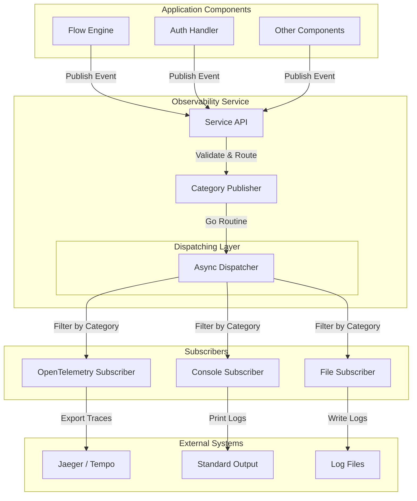

# Observability Architecture

This document describes the internal architecture of Thunder's observability system, including how events are published, processed, and routed to various outputs.

## Helper Diagram

The following diagram illustrates the high-level data flow within the observability system:

## Core Components

The observability system is built on a **Publisher-Subscriber** pattern designed to be non-blocking and decoupled from the core business logic.

### 1. Observability Service (`Service`)

The `Service` is the main entry point for the application. It acts as a facade that:
- Manages the lifecycle of the observability system.
- Handles configuration loading.
- Registers subscribers during initialization.
- Provides a simple `PublishEvent` API for application components.

### 2. Publisher (`CategoryPublisher`)

The `CategoryPublisher` is the core event bus. It implements a "fire-and-forget" mechanism to ensure that observability work does not impact the performance of the request path.

- **Asynchronous Processing**: All event processing happens in a background goroutine. The `Publish` method returns immediately.
- **Category-Based Routing**: Events are routed to subscribers based on their category (e.g., `observability.flows`, `observability.authentication`). This avoids sending irrelevant events to subscribers (e.g., sending high-volume debug logs to a costly tracing backend).
- **Graceful Shutdown**: It tracks active processing specifically to allow for a graceful shutdown, ensuring no events are lost when the server stops.

### 3. Subscribers (`Subscriber`)

Subscribers are responsible for consuming events and sending them to specific destinations. Each subscriber:
- **Self-Registers**: Subscribers register themselves with the service, declaring which categories they are interested in.
- **Filters Events**: Subscribers can further filter events based on their own logic.
- **Handles Formatting**: Each subscriber formats the event appropriately for its output (e.g., JSON for logs, Spans for OpenTelemetry).

**Available Subscribers:**
- **Console Subscriber**: Prints events to stdout/stderr (useful for development).
- **File Subscriber**: Writes events to a local log file (useful for auditing).
- **OpenTelemetry Subscriber**: Converts events into OTel Spans and exports them to a collector (Jaeger, Tempo, etc.).

## Event Processing Flow

1.  **Event Creation**: A component (e.g., `FlowEngine`) creates an event using `event.NewEvent()`, attaching a `TraceID` and relevant data.
2.  **Submission**: The component calls `service.PublishEvent(evt)`.
3.  **Validation**: The service validates the event (checking for required fields like `TraceID`).
4.  **Async Dispatch**: The event is passed to the Publisher, which immediately spins up a background task (or adds to a queue) and returns control to the caller.
5.  **Routing**: The Publisher checks which subscribers are subscribed to the event's category.
6.  **Delivery**: The event is delivered to each matching subscriber's `OnEvent` method.
7.  **Export**: The subscriber processes the event (e.g., sending a span to Jaeger).
