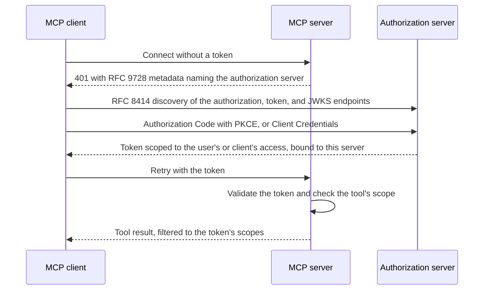

# MCP Authorization

The Model Context Protocol (MCP) gives AI assistants and agents a standard way to call tools and read data through MCP servers. An MCP deployment has three parties: an MCP host or client that a user or agent interacts with, an MCP server that exposes tools and resources, and an authorization server that decides who may call which tool.

## Why MCP Tools Need Authorization

An MCP server's tools are not always low-risk. They can read files, query databases, send email, or modify infrastructure. Without access control, every client that can reach the server can invoke every tool it exposes, with no boundary between a low-risk read and a destructive write.

:::note
Everything on this page applies to an MCP server reached over HTTP. An MCP server launched locally over stdio is outside the MCP authorization specification; its client takes credentials from the environment instead of running an OAuth flow.
:::

## How the MCP Authorization Specification Solves It

The [MCP Authorization specification](https://modelcontextprotocol.io/specification/2025-06-18/basic/authorization) treats an MCP server as an OAuth 2.1 resource server and separates it from the authorization server that issues tokens.

A client that connects without a token gets a `401` response carrying a `WWW-Authenticate` header. That header points at [RFC 9728](https://datatracker.ietf.org/doc/html/rfc9728) protected-resource metadata, a document the MCP server publishes that names its authorization server. The client resolves that authorization server's own metadata through [RFC 8414](https://datatracker.ietf.org/doc/html/rfc8414) discovery, which lists the authorization, token, and JWKS endpoints.

The client then runs one of two OAuth flows, depending on who it acts for:

- **Authorization Code with PKCE**, when a signed-in user delegates access to the client.
- **Client Credentials**, when the client authenticates on its own behalf, with no user involved.

The token the client gets back is bound to the specific MCP server it requested, through an audience or resource identifier. That binding stops a token issued for one MCP server from being replayed against another, even when both trust the same authorization server.

The MCP server enforces this at the tool boundary: it checks the token's scope before a tool handler runs, not after, so a caller without the right scope never reaches the tool's side effects.

## How <ProductName /> Fits

<ProductName /> plays two roles in an MCP deployment.

### Authorization Server for Your MCP Servers

You register your MCP server as a resource server and define one permission per tool. <ProductName /> issues access tokens scoped to only the permissions the signed-in user or client actually holds, and your MCP server's tools validate those scopes before they run.

### Identity Home for MCP Clients

Every MCP client needs OAuth credentials from <ProductName /> before it can request a token, whether it is an AI assistant, an autonomous agent, or a debugging tool such as MCP Inspector. You either register the client as an application in the Console ahead of time, or let it register itself the first time it connects, through Dynamic Client Registration.

## What <ProductName /> Provides

| Capability | What It Gives You |
|---|---|
| **MCP Client application type** | Register a client as user-delegated (Authorization Code with PKCE) or machine-to-machine (Client Credentials). |
| **Resource server registration** | Register your MCP server and turn each tool into a permission. The permission's handle becomes the scope tools validate. |
| **Dynamic Client Registration** | Let a client such as Claude Code register its own OAuth credentials the first time it connects. |
| **Consent** | Show a consent screen so a user approves the scopes a client requests on their behalf. |
| **AuthZEN-based tool authorization** | Ask <ProductName /> for a runtime authorization decision on a tool call, instead of relying on the token's scopes alone. |
| **Enterprise-Managed Authorization** | Accept or issue Identity Assertion Authorization Grants (ID-JAG) so an enterprise identity provider centralizes MCP access decisions. |

## Enterprise-Managed Authorization

Enterprises that already centralize access decisions in an identity provider can extend that model to MCP through the Identity Assertion Authorization Grant (ID-JAG). <ProductName /> can accept ID-JAGs issued by an external identity provider, or issue them itself as the enterprise identity provider for a downstream MCP authorization server. See [Enterprise-Managed Authorization](../../../use-cases/ai-agents/mcp-authorization/enterprise-managed-authorization) for the pattern, and [Identity Assertion Authorization Grant (ID-JAG)](../../protocols/oauth-oidc/identity-assertion-grant) for the protocol reference.

## <ProductName />'s Own MCP Server

Separately from securing your own MCP servers, <ProductName /> ships an admin MCP server at the `/mcp` endpoint. It lets MCP clients manage <ProductName /> applications, flows, users, and themes directly, in natural language, instead of through the Console UI. See [MCP Server](../../../working-with-ai/mcp-server) for setup and the available tools.

## Related

- [MCP Client Identity](../mcp-clients): how an MCP client gets OAuth credentials, and how to choose in <ProductName />.
- [MCP Server Authorization](../mcp-server): how an MCP server enforces access, and how to configure it in <ProductName />.
- [Connect a Python MCP Server](../../../getting-started/connect-your-mcp/python): a runnable quickstart with a sample MCP server.
- [Securing MCP](../../../use-cases/ai-agents/mcp-authorization/overview): authorization patterns for MCP servers and clients.
