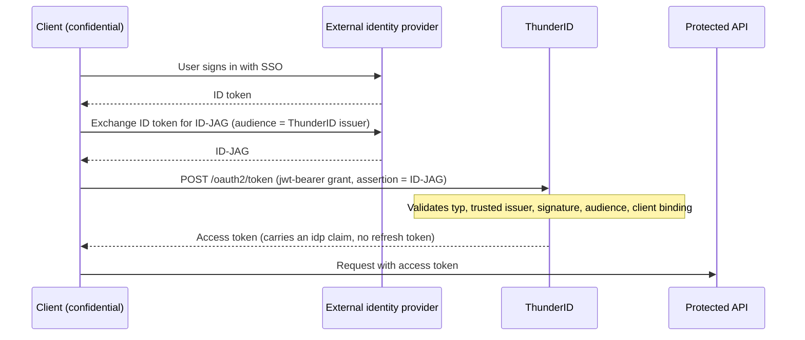

# Accept Identity Assertions from an External IdP

Register an external identity provider as a trusted token issuer so <ProductName /> accepts the **Identity Assertion Authorization Grants (ID-JAGs)** it issues and exchanges them for <ProductName />-issued access tokens.

## When to Use This

Use this when an enterprise identity provider, such as Okta, Azure AD, or another ID-JAG-capable issuer, governs which clients can reach your APIs. Clients arrive at <ProductName /> already holding an ID-JAG from that identity provider instead of signing in to <ProductName /> directly. When the protected resource is an MCP server, this is an instance of the Enterprise-Managed Authorization pattern; see [Enterprise-Managed Authorization for MCP](../../../../../use-cases/ai-agents/mcp-authorization/enterprise-managed-authorization).

## Prerequisites

- A running <ProductName /> deployment. See [Get Started](../../../../../getting-started/get-thunderid).
- Console access.
- The external identity provider's issuer URI and JWKS endpoint.
- An application configured as described in [Configure the Application](#configure-the-application).

## How Acceptance Works

A client that already holds an ID-JAG from an external identity provider presents it to <ProductName /> using the `jwt-bearer` grant, and receives an access token without a separate sign-in step.



## Register the Issuer

1. In the Console, navigate to **Connections**.
2. Select **Add custom connection**.
3. In the wizard, choose the connection type **Trusted Token Issuer**.
4. Name the connection and continue.
5. In the **Add trusted issuer** form, fill in:
    - **Issuer URI**: the external identity provider's issuer identifier. <ProductName /> matches this against the `iss` claim of incoming assertions.
    - **JWKS endpoint**: the URL <ProductName /> fetches the identity provider's public signing keys from, used to verify assertion signatures.
6. Leave **Enable token exchange** at its default (on), or turn it off if you do not also want this issuer's tokens accepted for RFC 8693 token exchange. When token exchange is on, a **Trusted token audience** field appears; leave it empty for ID-JAG-only use cases.
7. Turn on **Enable Identity Assertion JWT Authorization Grant (ID-JAG)**. This toggle is off by default.
8. Click **Create connection**.

:::note
**Enable token exchange** and **Enable Identity Assertion JWT Authorization Grant (ID-JAG)** are independent trust settings. Enabling one does not enable the other.
:::

## Configure the Application

The client that presents ID-JAGs to <ProductName /> must be a confidential client, and its allowed grant types must include `urn:ietf:params:oauth:grant-type:jwt-bearer`.

## What the Issuer Must Send

The external identity provider's ID-JAG must satisfy these requirements for <ProductName /> to accept it:

| Claim or header | Requirement |
|---|---|
| `typ` (header) | Exactly `oauth-id-jag+jwt` |
| `iss` | Matches a connection registered as a trusted ID-JAG issuer |
| Signature | Verifiable against that connection's JWKS endpoint |
| `aud` | Exactly one value, equal to the <ProductName /> issuer identifier, not the token endpoint URL |
| `client_id` | Equal to the authenticated client's id |
| `sub` | Present |
| `exp`, `iat`, `jti` | Present. See [Limitations](#limitations) for the `jti` replay caveat. |
| `scope` | Optional. When present, the issued access token's scope is the intersection of this claim and the request's `scope` parameter. |
| `resource` | Optional. When present, the request's `resource` parameter must be a subset of this claim. When absent, any valid resource is accepted. |

The client then presents the assertion to <ProductName />'s token endpoint using the `jwt-bearer` grant:

```bash
curl -X POST https://thunderid.example.com/oauth2/token \
  -u "$CLIENT_ID:$CLIENT_SECRET" \
  -d grant_type=urn:ietf:params:oauth:grant-type:jwt-bearer \
  -d assertion="$ID_JAG"
```

## Request Parameters

| Parameter | Required | Value |
|---|---|---|
| `grant_type` | Yes | `urn:ietf:params:oauth:grant-type:jwt-bearer` |
| `assertion` | Yes | The ID-JAG JWT issued by a trusted external identity provider |
| `scope` | No | Narrows the assertion's `scope` claim by intersection |
| `resource` | No, repeatable | Must be a subset of the assertion's `resource` claim; selects one resource server when the assertion authorizes several |

## Response

| Field | Value |
|---|---|
| `access_token` | The issued access token |
| `token_type` | `Bearer`, or `DPoP` when the request includes a DPoP proof |
| `expires_in` | Token lifetime in seconds |
| `scope` | The granted scope (intersection of the request scope and the assertion's scope) |

No `issued_token_type` or `refresh_token` is returned.

## How Validation Works

<ProductName /> validates an incoming assertion in this order:

1. Checks the `typ` header is `oauth-id-jag+jwt`.
2. Looks up a trusted ID-JAG issuer connection matching the assertion's `iss` claim. If none matches: `invalid_grant` - `The assertion issuer is not registered as a trusted ID-JAG issuer`.
3. Verifies the signature against that connection's JWKS endpoint.
4. Validates the time claims. If the assertion has expired: `invalid_grant` - `The assertion has expired`.
5. Checks the `aud` claim is exactly one value equal to this server's issuer. If not: `invalid_grant` - `The assertion audience must be exactly this server's issuer`.
6. Checks `client_id` matches the authenticated client. Any other claim failure returns `invalid_grant` - `Invalid assertion`.
7. Confirms the `sub` claim is present.

Requests missing the `assertion` parameter fail with `invalid_request` - `Missing required parameter: assertion`. A public client attempting the grant fails with `invalid_client` - `The jwt-bearer grant requires a confidential client`. An application without the `jwt-bearer` grant type fails with `unauthorized_client` - `The client is not authorized to use this grant type`. A `resource` parameter that is not a subset of the assertion's `resource` claim fails with `invalid_target` - `The resource parameter must be a subset of the assertion's resource claim`; omitting `resource` when no default resource server is configured fails with `invalid_target` - `No resource parameter supplied and no default resource server is configured`.

## The Tokens <ProductName /> Issues

The issued access token's `sub` claim is the assertion's subject verbatim, an external identifier rather than a local user id. An `idp` claim carries the assertion's issuer. <ProductName /> does not link this subject to a local account or apply attribute mapping, and no refresh token is issued. The token is DPoP-bound when the request includes a DPoP proof. A `scope` parameter in the request narrows the assertion's `scope` claim by intersection, and a `resource` parameter must be a subset of the assertion's `resource` claim, selecting one resource server when the assertion authorizes several.

## Limitations

- There is no replay cache. <ProductName /> checks that `jti` is present but does not track previously seen values, so keep assertion expiry short.
- No local user mapping occurs. The token's `sub` is the external identifier as-is.
- <ProductName /> does not advertise ID-JAG or Enterprise-Managed Authorization discovery metadata in its well-known documents.

:::note
This page covers accepting assertions for token issuance. The [Secure <ProductName /> Using a Third-Party Identity Provider](../../../../trusted-issuer) guide is a different feature: it validates external tokens directly against <ProductName />'s own APIs without issuing a new token.
:::

## Next Steps

- [Issue Identity Assertions (ID-JAG)](../issue-identity-assertions) - Configure <ProductName /> to exchange a user's ID token for an ID-JAG
- [Identity Assertion Authorization Grant (ID-JAG)](..) - Overview of both ID-JAG roles
- [Token Exchange with External Identity Providers](../../../../identity-providers/token-exchange-idp) - RFC 8693 token exchange for external identity provider tokens
- [Enterprise-Managed Authorization for MCP](../../../../../use-cases/ai-agents/mcp-authorization/enterprise-managed-authorization) - Use ID-JAG to authorize MCP clients without a second sign-in
