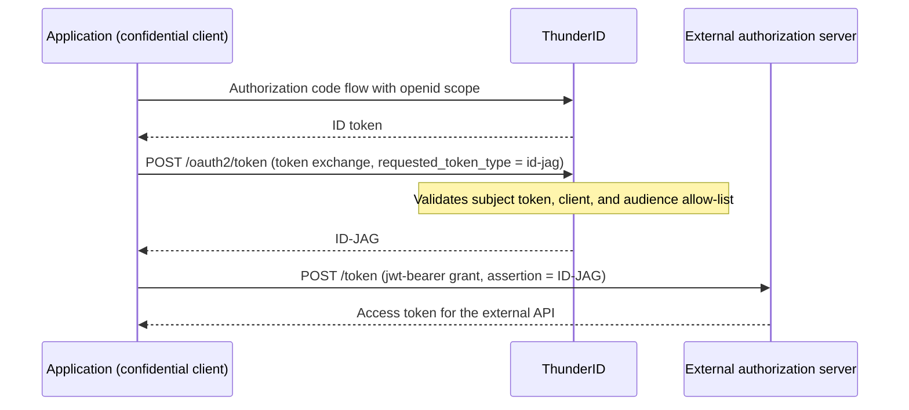

# Issue Identity Assertions (ID-JAG)

Configure your <ProductName /> application so it can exchange a signed-in user's ID token for an **Identity Assertion Authorization Grant (ID-JAG)**, a signed JWT that an external authorization server accepts as proof of the user's identity when issuing its own access token. This guide walks through the full flow: enabling ID-JAG issuance on the application, obtaining an ID token, exchanging it, and presenting the resulting assertion to an external server.

## When to Use This

Use this when your application's users need to access an external, ID-JAG-aware service, such as an MCP server or a partner API, without signing in there a second time. The external authorization server trusts the assertion your application obtained from <ProductName /> and issues its own access token based on it.

## Prerequisites

- A running <ProductName /> deployment. See [Get Started](../../../../../getting-started/get-thunderid).
- Console access.
- [An application](../../../../applications/manage-applications) that supports the authorization code grant and uses a confidential client. Public clients cannot issue identity assertions.

## How Issuance Works

An application already signed in to <ProductName /> exchanges its ID token for an ID-JAG, then presents that ID-JAG to an external authorization server to obtain an access token for an external API.



## Enable Identity Assertions

1. In the Console, navigate to **Applications**.
2. Select the application.
3. Open the **Advanced** tab.
4. Find the **Identity Assertions (ID-JAG)** card and turn on the toggle.
5. Under **Allowed audiences**, add the identifiers of the external authorization servers this application can request assertions for. Each assertion targets exactly one of these audiences, and the entries must exactly match the `audience` value your application sends in the exchange request.
6. Set **Assertion validity** in seconds. The default is `300`.

:::note
Turning on identity assertions also enables the token exchange grant type on the application.
:::

:::note
The toggle is disabled for public clients. Turn off **Public Client** on the application first.
:::

## Get an ID Token

Run the authorization code flow with the `openid` scope to obtain an ID token for the signed-in user.

Export the `client_id`, `client_secret`, and registered redirect URI from your application's Console entry, since the following steps need them:

```bash
export CLIENT_ID=<your client id>
export CLIENT_SECRET=<your client secret>
export REDIRECT_URI=<your registered redirect uri>
```

1. Send the user's browser to the authorize endpoint:

```text
https://thunderid.example.com/oauth2/authorize?response_type=code&client_id=$CLIENT_ID&redirect_uri=$REDIRECT_URI&scope=openid&state=xyz
```

Replace `$CLIENT_ID` and `$REDIRECT_URI` with their real values before pasting this URL into a browser; shell variables do not expand there.

2. After the user signs in (and consents, if consent is enabled for the application), <ProductName /> redirects the browser to `$REDIRECT_URI` with a `code` query parameter. Capture it from the callback URL and export it:

```bash
export CODE=<code from the callback URL>
```

3. Exchange the code for an ID token:

```bash
curl -X POST https://thunderid.example.com/oauth2/token \
  -u "$CLIENT_ID:$CLIENT_SECRET" \
  -H 'Content-Type: application/x-www-form-urlencoded' \
  -d 'grant_type=authorization_code' \
  -d "code=$CODE" \
  -d "redirect_uri=$REDIRECT_URI"
```

4. Export the ID token from the response:

```bash
export ID_TOKEN=<id_token from the response>
```

## Exchange It for an ID-JAG

Send the ID token to the token endpoint with the token exchange grant type, requesting an ID-JAG for the external authorization server's audience:

```bash
curl -X POST https://thunderid.example.com/oauth2/token \
  -u "$CLIENT_ID:$CLIENT_SECRET" \
  -d grant_type=urn:ietf:params:oauth:grant-type:token-exchange \
  -d requested_token_type=urn:ietf:params:oauth:token-type:id-jag \
  -d subject_token="$ID_TOKEN" \
  -d subject_token_type=urn:ietf:params:oauth:token-type:id_token \
  -d audience=https://external-as.example.com
```

A successful response returns the ID-JAG:

```json
{
  "access_token": "eyJhbGciOi...",
  "token_type": "N_A",
  "expires_in": 300,
  "issued_token_type": "urn:ietf:params:oauth:token-type:id-jag"
}
```

:::note
`token_type` is `N_A` per RFC 8693: the returned token is a grant to present to the external authorization server, not a Bearer token to call an API with directly.
:::

Export the `access_token` value as the ID-JAG for the next steps:

```bash
export ID_JAG=<access_token from the response>
```

## Inspect the Assertion

The `access_token` field is a JWT. Decode its payload to see the claims:

```bash
python3 -c 'import base64,sys;s=sys.argv[1].split(".")[1];print(base64.urlsafe_b64decode(s+"="*(-len(s)%4)).decode())' "$ID_JAG"
```

The header sets `typ` to `oauth-id-jag+jwt`:

```json
{
  "alg": "RS256",
  "kid": "isP0lckl...",
  "typ": "oauth-id-jag+jwt"
}
```

The payload carries the assertion's claims:

```json
{
  "aud": "https://external-as.example.com",
  "client_id": "my_client_id",
  "exp": 1780000300,
  "iat": 1780000000,
  "iss": "https://thunderid.example.com",
  "jti": "f47ac10b-...",
  "nbf": 1780000000,
  "sub": "a1b2c3d4-..."
}
```

- `iss`: the <ProductName /> issuer that signed the assertion.
- `sub`: the local user id of the signed-in user.
- `aud`: the single audience requested in the exchange.
- `client_id`: the application that requested the assertion.
- `exp`, `iat`, `nbf`, `jti`: standard timing and uniqueness claims.

The assertion also carries a `scope` claim when the exchange request included a `scope` parameter, and a `resource` claim when it included one or more `resource` parameters, as a string for a single value or an array for several.

## Present It to the External Server

Send the ID-JAG to the external authorization server's token endpoint using the `jwt-bearer` grant. The external server validates the assertion and issues its own access token, governed entirely by that server's own configuration and policy:

```bash
curl -X POST https://external-as.example.com/token \
  -d grant_type=urn:ietf:params:oauth:grant-type:jwt-bearer \
  -d assertion="$ID_JAG"
```

## Request Parameters

| Parameter | Required | Value |
|---|---|---|
| `grant_type` | Yes | `urn:ietf:params:oauth:grant-type:token-exchange` |
| `requested_token_type` | Yes | `urn:ietf:params:oauth:token-type:id-jag` |
| `subject_token` | Yes | An ID token issued by <ProductName /> to the requesting application. Access tokens, refresh tokens, external ID tokens, and ID-JAGs are rejected. |
| `subject_token_type` | Yes | `urn:ietf:params:oauth:token-type:id_token` |
| `audience` | Yes, exactly one | Identifier of the external authorization server. Must exactly match an entry in the application's allowed audiences (string equality, no wildcards or URL normalization). |
| `resource` | No, repeatable | Absolute URI without a fragment. Embedded verbatim in the grant's `resource` claim. |
| `scope` | No | Space-delimited. Embedded verbatim in the grant's `scope` claim. Not checked against the application's or subject token's scopes; the external server enforces its own policy. |

## Response

| Field | Value |
|---|---|
| `access_token` | The ID-JAG JWT |
| `token_type` | `N_A` (RFC 8693: the value is not a usable access token type; the ID-JAG must not be sent as a Bearer token) |
| `expires_in` | The configured assertion validity, default 300 seconds |
| `scope` | The scope embedded in the grant |
| `issued_token_type` | `urn:ietf:params:oauth:token-type:id-jag` |

No refresh token is issued.

## The Issued JWT

The header sets `typ` to `oauth-id-jag+jwt`.

| Claim | Value |
|---|---|
| `iss` | <ProductName /> issuer |
| `sub` | Local user id |
| `aud` | The single requested audience |
| `client_id` | The requesting client |
| `exp` / `iat` / `nbf` / `jti` | Standard timing and uniqueness claims |
| `scope` | Optional, present when a scope was requested |
| `resource` | Optional, present when a resource was requested |

## Troubleshooting

| Error | Description text | Cause |
|---|---|---|
| `invalid_request` | Missing required parameter: subject_token (or subject_token_type) | Parameter absent |
| `invalid_request` | ID-JAG requests require subject_token_type urn:ietf:params:oauth:token-type:id_token | Wrong subject token type |
| `invalid_request` | subject_token must be an ID token issued to this client | Subject token is not a valid self-issued ID token |
| `invalid_request` | subject_token audience does not match the authenticated client | ID token was issued to a different application |
| `invalid_target` | The client is not permitted to request ID-JAGs | ID-JAG disabled on the application or no allowed audiences |
| `invalid_target` | The audience parameter is required for ID-JAG requests / Exactly one audience is required for ID-JAG requests / The requested audience is not permitted for this client | Audience missing, repeated, or not in the allow-list |
| `invalid_target` | Invalid resource parameter: must be an absolute URI (or must not contain a fragment component) | Malformed resource |
| `invalid_client` | ID-JAG requests require a confidential client | Public client |
| `unauthorized_client` | The client is not authorized to use this grant type | Token exchange grant not enabled on the application |
| `server_error` | Failed to process token request | Internal failure, including unavailable revocation status |

## Related Guides

- [Accept Identity Assertions](../accept-identity-assertions) - Configure <ProductName /> to accept ID-JAGs issued by an external identity provider
- [Identity Assertion Authorization Grant (ID-JAG)](..) - Overview of both ID-JAG roles
- [Enterprise-Managed Authorization for MCP](../../../../../use-cases/ai-agents/mcp-authorization/enterprise-managed-authorization) - Use ID-JAG to authorize MCP clients without a second sign-in
