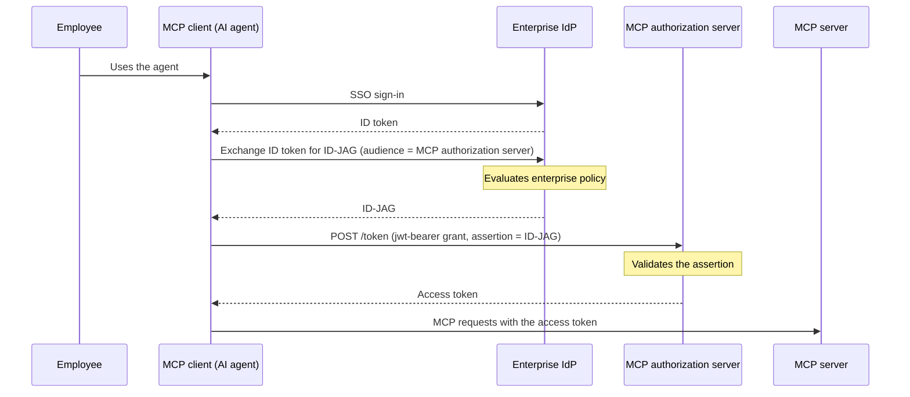

# Enterprise-Managed Authorization

In an enterprise, having each user authorize each MCP server individually does not scale. Every new server means another consent screen, and there is no central point where an administrator can see or revoke what an agent has been granted. The Model Context Protocol's Enterprise-Managed Authorization (EMA) extension (`io.modelcontextprotocol/enterprise-managed-authorization`) addresses this by making the organization's identity provider the decision point instead of the end user, using the Identity Assertion Authorization Grant (ID-JAG) as the wire format that carries the identity provider's decision to the MCP authorization server.

See the [EMA extension page](https://modelcontextprotocol.io/extensions/auth/enterprise-managed-authorization), its [full specification](https://github.com/modelcontextprotocol/ext-auth/blob/main/specification/stable/enterprise-managed-authorization.mdx) in `modelcontextprotocol/ext-auth`, the IETF draft it builds on (`draft-ietf-oauth-identity-assertion-authz-grant`), and the [Identity Assertion Authorization Grant (ID-JAG)](../../../../guides/protocols/oauth-oidc/identity-assertion-grant) protocol reference for how <ProductName /> implements both sides of the exchange.

## The Flow

The employee's sign-in never touches the MCP authorization server directly. The enterprise identity provider evaluates its own policy when it issues the ID-JAG, so access decisions are made and audited in one place regardless of how many MCP servers the organization runs.

## Where <ProductName /> Fits

<ProductName /> can sit on either side of this exchange.

### As the MCP Authorization Server

<ProductName /> protects the MCP server and accepts ID-JAGs issued by the enterprise identity provider. Register that identity provider as a **Trusted Token Issuer** connection with ID-JAG enabled, and clients present their ID-JAGs to <ProductName />'s token endpoint using the `jwt-bearer` grant to receive an access token for the MCP server. See [Accept Identity Assertions from an External IdP](../../../../guides/protocols/oauth-oidc/identity-assertion-grant/accept-identity-assertions).

### As the Enterprise IdP

<ProductName /> can also act as the enterprise identity provider issuing the ID-JAGs. An application already signed in to <ProductName />, with the **Identity Assertions (ID-JAG)** toggle enabled, exchanges its ID token for an ID-JAG targeting a downstream MCP authorization server, then presents that grant to obtain an access token for the MCP server it needs to reach. See [Issue Identity Assertions (ID-JAG)](../../../../guides/protocols/oauth-oidc/identity-assertion-grant/issue-identity-assertions).

## Terminology Map

| EMA term | <ProductName /> feature |
|---|---|
| MCP authorization server validating ID-JAGs | The jwt-bearer grant with a **Trusted Token Issuer** connection |
| Enterprise IdP issuing ID-JAGs | Token exchange with **Identity Assertions (ID-JAG)** enabled on an application |
| Identity assertion (the IdP's proof of sign-in, per the IETF draft) | The ID token obtained at sign-in |
| ID-JAG | The JWT with header `typ: oauth-id-jag+jwt` |

## Related

- [Identity Assertion Authorization Grant (ID-JAG)](../../../../guides/protocols/oauth-oidc/identity-assertion-grant)
- [Issue Identity Assertions (ID-JAG)](../../../../guides/protocols/oauth-oidc/identity-assertion-grant/issue-identity-assertions)
- [Accept Identity Assertions from an External IdP](../../../../guides/protocols/oauth-oidc/identity-assertion-grant/accept-identity-assertions)
- [Securing MCP](../overview)
