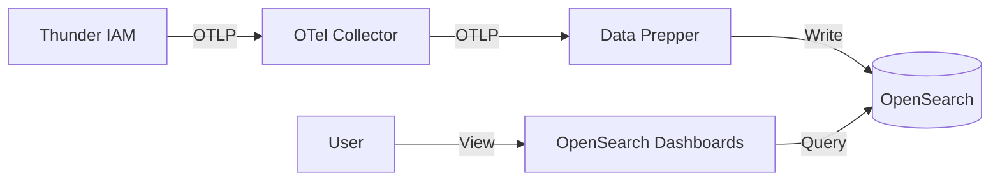

# OpenSearch Analytics Dashboard

This guide explains how to set up a comprehensive analytics dashboard for Thunder using OpenSearch, Data Prepper, and the OpenTelemetry Collector. This setup allows you to visualize login flows, trace requests, and analyze system performance.

## Architecture

The analytics pipeline consists of the following components:

1.  **Thunder**: Publishes OTLP traces/metrics to the OpenTelemetry Collector.
2.  **OpenTelemetry Collector**: Receives data, batches it, and exports it to Data Prepper.
3.  **Data Prepper**: Serves as the server-side data collector for OpenSearch. It transforms OTLP data into OpenSearch-compatible indexes.
4.  **OpenSearch**: Stores the indexed data.
5.  **OpenSearch Dashboards**: Provides the user interface for visualization and Trace Analytics (instructions below are for v3.3.0).



## Setup Instructions

We will use Docker Compose to spin up the infrastructure.

### 1. Configuration Files

Create a directory for your analytics setup (e.g., `analytics/`) and add the following files.

#### `docker-compose.yaml`

This compose file runs OpenSearch, Data Prepper, and the OTel Collector. Jaeger has been removed to streamline the setup for production-grade analytics.

```yaml
version: '3.8'

services:
  opensearch:
    image: opensearchproject/opensearch:latest
    container_name: opensearch
    environment:
      - discovery.type=single-node
      - OPENSEARCH_JAVA_OPTS=-Xms512m -Xmx512m
      - DISABLE_SECURITY_PLUGIN=true
    volumes:
      - opensearch-data:/usr/share/opensearch/data
    ports:
      - "9200:9200"
    networks:
      - otel

  opensearch-dashboards:
    image: opensearchproject/opensearch-dashboards:latest
    container_name: opensearch-dashboards
    environment:
      - 'OPENSEARCH_HOSTS=["http://opensearch:9200"]'
      - DISABLE_SECURITY_DASHBOARDS_PLUGIN=true
    volumes:
      - dashboards-data:/usr/share/opensearch-dashboards/data
    ports:
      - "5601:5601"
    networks:
      - otel
    depends_on:
      - opensearch

  data-prepper:
    image: opensearchproject/data-prepper:latest
    container_name: data-prepper
    volumes:
      - ./pipelines.yaml:/usr/share/data-prepper/pipelines/pipelines.yaml
      - ./data-prepper.yaml:/usr/share/data-prepper/config/data-prepper-config.yaml
    ports:
      - "21890:21890"
    networks:
      - otel
    depends_on:
      - opensearch

  otel-collector:
    image: otel/opentelemetry-collector-contrib:latest
    container_name: otel-collector
    volumes:
      - ./otel-collector-config.yaml:/etc/otelcol-contrib/config.yaml
    ports:
      - "4317:4317" # OTLP gRPC endpoint used by Thunder
      - "4318:4318" # OTLP HTTP endpoint
      - "8888:8888"
      - "8889:8889"
    networks:
      - otel
    depends_on:
      - data-prepper

volumes:
  opensearch-data:
  dashboards-data:

networks:
  otel:
```

#### `otel-collector-config.yaml`

Configures the Collector to receive OTLP data and export it to Data Prepper.

```yaml
receivers:
  otlp:
    protocols:
      grpc:
        endpoint: 0.0.0.0:4317
      http:
        endpoint: 0.0.0.0:4318

processors:
  batch:
    timeout: 1s
    send_batch_size: 1024

exporters:
  # Export to Data Prepper (OpenSearch)
  otlp/dataprepper:
    endpoint: data-prepper:21890
    tls:
      insecure: true

  # Debug exporter for logging to console
  debug:
    verbosity: normal

service:
  pipelines:
    traces:
      receivers: [otlp]
      processors: [batch]
      exporters: [otlp/dataprepper, debug]
```

#### `pipelines.yaml`

Configures Data Prepper to ingest OTLP traces and write them to the Trace Analytics indices.

```yaml
entry-pipeline:
  source:
    otel_trace_source:
      ssl: false
  sink:
    - opensearch:
        hosts: ["http://opensearch:9200"]
        index_type: trace-analytics-raw
```

#### `data-prepper.yaml`

Basic Data Prepper configuration.

```yaml
ssl: false
```

### 2. Configure Thunder

Update your `repository/conf/deployment.yaml` in Thunder to point to the OpenTelemetry Collector:

```yaml
observability:
  enabled: true
  output:
    opentelemetry:
      enabled: true
      exporter_type: "otlp"
      otlp_endpoint: "localhost:4317" # Points to the OTel Collector service
      insecure: true
```

### 3. Running the Stack

Start the observability infrastructure:

```bash
docker-compose up -d
```

### 4. Viewing Traces

1.  Open your browser and navigate to **[http://localhost:5601](http://localhost:5601)**.
2.  Click on the **menu icon** (top left) and select **Observability > Traces**.
3.  You can see the published traces in this view. Use the filter bar to search for specific trace IDs or service names.

## Analytics Dashboard

Thunder provides pre-configured dashboards for visualizing login flows and system performance.

### Resources

The dashboard configuration files are located in `docs/guides/observability/dashboards/`:
*   `visualizations.ndjson`: Individual charts and graphs (e.g., Login Success Rate, Latency Distribution).
*   `dashboard.ndjson`: The assembled dashboard which aggregates these visualizations.

### Import Instructions

1.  Open OpenSearch Dashboards (http://localhost:5601).
2.  Navigate to **Dashboards Management > Saved Objects**.
3.  Click **Import** in the top right corner.
4.  **Step 1: Import Visualizations**
    *   Select `visualizations.ndjson`.
    *   Click **Import**.
    *   *Note: These must be imported first as the dashboard depends on them.*
5.  **Step 2: Import Dashboard**
    *   Select `dashboard.ndjson`.
    *   Click **Import**.

### Accessing the Dashboard

1.  Navigate to **OpenSearch Dashboards > Dashboard** in the main menu.
2.  Select the **Thunder Analytics** dashboard from the list.
3.  To explore or modify all available charts (including those not on the main dashboard), navigate to **OpenSearch Dashboards > Visualize** in the main menu.

