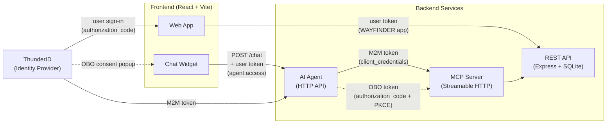

# Agent Identity Sample (Wayfinder)

End-to-end sample of an AI agent that holds its own ThunderID-managed identity.

The agent uses **its own access token (client_credentials grant)** for browsing tools and switches to a **user-context token via OAuth 2.0 authorization-code + PKCE** when a tool needs the user's consent (booking, cancellation, viewing the user's own data).

The sample is a travel booking app called Wayfinder. A chat widget in the UI talks to a LangChain agent that calls REST tools through an MCP server.

## Architecture



### Token Flow

The sample uses two OAuth clients and three token types:

| Token | OAuth Client | Grant | Purpose |
|-------|-------------|-------|---------|
| **User token** | `WAYFINDER` | `authorization_code` | Frontend sign-in, API calls, chat API auth (`agent:access` scope) |
| **M2M token** | `WAYFINDER-CHAT-AGENT` | `client_credentials` | Agent's own identity for browsing tools (search flights, hotels) via MCP |
| **OBO token** | `WAYFINDER-CHAT-AGENT` | `authorization_code` + PKCE | User-context token for mutating tools (booking, cancellation) via MCP |

**How it works:**

1. The user signs in to the Wayfinder web app via the `WAYFINDER` OAuth application. The issued token carries `agent:access` (from the Wayfinder Chat User role).
2. When the user sends a chat message, the frontend calls `POST /chat` on the AI Agent API with the user's access token in the `Authorization` header. The AI Agent validates the token has the `agent:access` scope before processing the message.
3. For browsing tools (search flights, search hotels), the AI Agent uses its own M2M token (obtained via `client_credentials` with the `WAYFINDER-CHAT-AGENT` credentials) to call the MCP server, which proxies to the REST API.
4. For mutating tools (create booking, cancel booking), the AI Agent returns a `need_user_consent` response. The frontend opens a consent popup, the user signs in and picks which booking permissions to grant (`booking:read`, `booking:create`, `booking:cancel`), and the authorization code is submitted to `POST /chat/consent`. The agent exchanges it for a user-context token, and the frontend retries the original message.
5. The REST API validates the JWT on every request and enforces scopes per route — browsing endpoints are open, booking endpoints require the matching `booking:*` scope.

## What This Demonstrates

- A ThunderID **agent** acting as an autonomous principal — distinct from a ThunderID user.
- The agent's **machine-to-machine (M2M) token** used for read-only browsing tools (search flights, search hotels, etc.).
- **Scope-based access control** on the AI Agent's HTTP API — only users with `agent:access` can use the chat. Users without this scope (e.g. `jane.smith`) can browse and book through the UI but cannot use the chat agent.
- An **on-behalf-of (OBO)** flow triggered from inside a chat session: the agent returns a consent request, the frontend opens a popup where the user picks which booking permissions to grant, and the issued user-context token only carries the approved subset.
- A REST API that **verifies the JWT** and **enforces scopes per route** (`booking:read`, `booking:create`, `booking:cancel`).
- **Multi-LLM support** — the chat agent works with both **Anthropic Claude** and **Google Gemini**, selectable via an environment variable.

## Project Structure

```text
agent-id-sample/
├── frontend/     React + Vite UI. Hosts the chat widget and the
│                 /agent-callback route used by the consent popup.
├── api/          Node REST API backed by SQLite. Validates JWTs
│                 and enforces scopes on booking routes.
├── mcp/          Streamable-HTTP MCP server that wraps the REST API.
├── ai-agent/     HTTP chat agent API (LangChain + Claude/Gemini).
├── resources/    Declarative YAML files for ThunderID setup.
└── README.md
```

Each subdirectory has its own README with the environment variables it reads and a `npm start` command.

## Prerequisites

- Node.js 20+
- A running ThunderID backend on `https://localhost:8090` (self-signed cert is fine).
- **One** of the following LLM API keys:
  - Anthropic API key from [console.anthropic.com](https://console.anthropic.com), **or**
  - Google Gemini API key from [aistudio.google.com](https://aistudio.google.com).

## ThunderID Setup

The `resources/` directory contains declarative YAML files that configure most of the ThunderID entities automatically. The agent must still be created manually since declarative agent support is not yet available.

### Step 1 — Load Declarative Resources

Find your ThunderID default organization unit ID. You can find it in the Console UI under **Organization Units**, or query the database:

```bash
sqlite3 backend/cmd/server/repository/database/configdb.db \
  "SELECT OU_ID FROM RESOURCE_SERVER WHERE NAME='System' LIMIT 1;"
```

Copy the sample's `resources/` subdirectories into ThunderID's declarative resource directory and set the OU ID:

```bash
export THUNDER_OU_ID=<your-ou-id>

# Copy resource files into the ThunderID server's resources directory
cp -r samples/apps/agent-id-sample/resources/resource_servers \
      backend/cmd/server/repository/resources/
cp -r samples/apps/agent-id-sample/resources/roles \
      backend/cmd/server/repository/resources/
cp -r samples/apps/agent-id-sample/resources/users \
      backend/cmd/server/repository/resources/
cp -r samples/apps/agent-id-sample/resources/applications \
      backend/cmd/server/repository/resources/
```

Restart the ThunderID server. On startup it will load:

| Resource | File | What it creates |
|----------|------|-----------------|
| Resource server | `resource_servers/wayfinder-agent.yaml` | `wayfinder-agent` resource server with `agent:access` permission |
| Resource server | `resource_servers/booking-api.yaml` | `booking-api` resource server with `booking:read`, `booking:create`, `booking:cancel` permissions |
| Role | `roles/wayfinder-chat-user.yaml` | **Wayfinder Chat User** role with `agent:access`, assigned to `john.doe` |
| Role | `roles/wayfinder-user.yaml` | **Wayfinder User** role with booking permissions, assigned to both demo users |
| User | `users/john-doe.yaml` | Demo user `john.doe` / `john.doe` — has chat agent access and booking permissions |
| User | `users/jane-smith.yaml` | Demo user `jane.smith` / `jane.smith` — has booking permissions but **no** chat agent access |
| Application | `applications/wayfinder.yaml` | **WAYFINDER** OAuth app (public, PKCE, redirect to `http://localhost:5173`) |

### Step 2 — Manual Steps

These steps cannot be done declaratively yet:

**Create the agent.** In the Console UI or via the management API, create an agent named **`WAYFINDER-CHAT-AGENT`**:

1. Create the agent and capture the **client secret** — ThunderID prints it only once at creation. You will need it for `ai-agent/.env`.
2. Under the agent's **Protocol** settings, enable the **Authorization Code** grant (the Client Credentials grant is enabled by default for agents).
3. Add the authorized redirect URI: `http://localhost:5173/agent-callback`
4. Set the authentication flow to the built-in **Default Basic Authentication Flow** (`default-basic-flow`).
5. Under `accessToken.userAttributes`, add: `given_name`, `family_name`, `email`, `groups`.

## Configure the Sample

`api/`, `ai-agent/`, and `frontend/` each ship with a `.env.example` listing only the variables you actually need to set. In each of those folders, copy it to `.env` and fill the placeholders. The `mcp/` server has no required configuration.

The two placeholder values you must replace are in `ai-agent/.env`:

- `AGENT_SECRET=` — the agent client secret captured at agent creation.
- `ANTHROPIC_API_KEY=` (or `GOOGLE_API_KEY=`) — your LLM API key.

Everything else in the examples is local development defaults that match the run instructions below.

## Run

In four terminals:

```bash
cd api      && npm install && npm run seed && npm start   # http://localhost:8787
cd mcp      && npm install && npm start                   # http://localhost:8000/mcp
cd ai-agent && npm install && npm start                   # http://localhost:8790/chat
cd frontend && npm install && npm run dev                 # http://localhost:5173
```

`npm run seed` initializes the local SQLite database with sample flights, hotels, and trips. Run it once on first setup.

## Try It

Open `http://localhost:5173`, sign in as `john.doe` / `john.doe`, open the chat widget, and try:

```
What flights are there from Colombo to Singapore?
```

These browsing tools use the agent's M2M token — no popup beyond the initial sign-in.

Then:

```
Book flight 2
```

The agent will pause and ask for your permission. A popup opens, you sign in as the demo user via the agent's OAuth application, you pick which booking permissions to grant in the consent screen, and the booking succeeds (or returns 403 if you denied `booking:create`).

### No Chat Access

Sign out and sign in as `jane.smith` / `jane.smith`. Jane can browse flights, hotels, and manage bookings through the web UI, but sending a chat message will return a 403 error — her token lacks the `agent:access` scope because she is not assigned the **Wayfinder Chat User** role.
