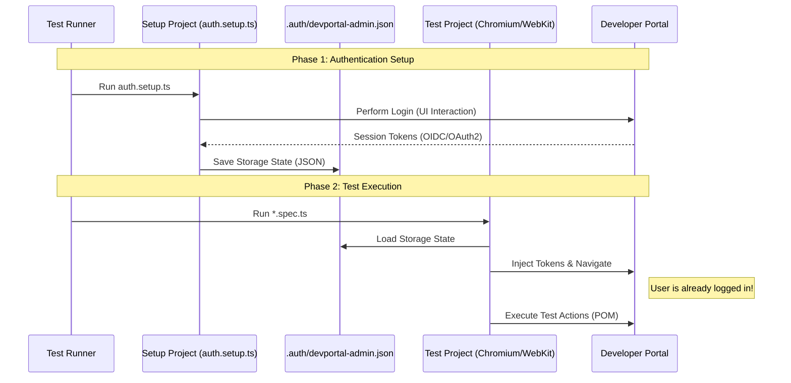

# Thunder Developer Portal E2E Tests

End-to-end automation test suite for the Thunder Developer Portal, built with [Playwright](https://playwright.dev/).

## 📋 Overview

This framework uses the **Page Object Model (POM)** design pattern and Playwright's **Global Setup / Project Dependencies** to handle authentication efficiently.

### Key Features

- **Centralized Authentication**: Login once via `setup` project, reuse session state across all tests.
- **Cross-Browser Support**: Configured for Chromium, Firefox, and WebKit (Safari).
- **Token-Based Auth Support**: Specialized utilities to capture and inject OIDC/OAuth2 tokens for the WSO2 IS backend.
- **Robustness**: Auto-retry logic, network idle waits, and intelligent locator handling.
- **CI/CD Friendly**: Includes a GitHub Actions workflow that maps repository secrets/variables (e.g., `PLAYWRIGHT_BASE_URL`, `PLAYWRIGHT_ADMIN_PASSWORD`) to test environment variables. Refer to the workflow file for the complete list of required configurations.

---

## 🚀 Getting Started

### Prerequisites

- Node.js (LTS version recommended)
- NPM

### Installation

1. Navigate to the e2e directory:
   ```bash
   cd thunder/tests/e2e
   ```
2. Install dependencies:
   ```bash
   npm ci
   ```
3. Install Playwright browsers:
   ```bash
   npx playwright install --with-deps
   ```

### Configuration

Create a `.env` file in the `e2e` directory (copy from `.env.example` if available):

```env
BASE_URL=https://localhost:8090
ADMIN_USERNAME=admin
ADMIN_PASSWORD=admin
TEST_USER_USERNAME=testuser
TEST_USER_PASSWORD=admin
```

---

## 🛠 CI/CD Configuration

The GitHub Actions workflow is designed to work with repository **Secrets** and **Variables**. The suite uses a priority system: **Secret > Variable > Hardcoded Default**.

### Required GitHub Settings

To customize the CI environment, add the following to **Settings > Secrets and variables > Actions**:

| Name                            | Type       | Purpose             | Fallback                 |
| :------------------------------ | :--------- | :------------------ | :----------------------- |
| `PLAYWRIGHT_BASE_URL`           | Variable   | App URL             | `https://localhost:8090` |
| `PLAYWRIGHT_ADMIN_USERNAME`     | Variable   | Admin Login         | `admin`                  |
| `PLAYWRIGHT_ADMIN_PASSWORD`     | **Secret** | Admin Password      | `admin`                  |
| `PLAYWRIGHT_TEST_USER_USERNAME` | Variable   | Test User Login     | `testuser`               |
| `PLAYWRIGHT_TEST_USER_PASSWORD` | **Secret** | Test User Password  | `admin`                  |
| `PLAYWRIGHT_WORKERS`            | Variable   | Parallel Processing | `1`                      |
| `PLAYWRIGHT_DEBUG_AUTH`         | Variable   | Auth Debug Logs     | `false`                  |

---

## 🏃‍♂️ Running Tests

### Standard Commands

| Command                 | Description                                                          |
| ----------------------- | -------------------------------------------------------------------- |
| `npm test`              | Run all tests on all configured browsers (Chromium, Firefox, WebKit) |
| `npm run test:chromium` | Run tests on Google Chrome/Chromium only                             |
| `npm run test:firefox`  | Run tests on Firefox only                                            |
| `npm run test:webkit`   | Run tests on Safari/WebKit only                                      |
| `npm run test:headed`   | Run tests with browser visible (headed mode)                         |
| `npm run test:debug`    | Run tests in debug mode with Playwright Inspector                    |
| `npm run test:trace`    | Run tests with tracing enabled for debugging                         |
| `npm run ui`            | Open Playwright's interactive UI mode (Debugging)                    |
| `npm run report`        | Open the HTML test report                                            |

### Code Quality Commands

| Command                | Description                         |
| ---------------------- | ----------------------------------- |
| `npm run lint`         | Check code for linting errors       |
| `npm run lint:fix`     | Automatically fix linting errors    |
| `npm run format`       | Format code with Prettier           |
| `npm run format:check` | Check if code is properly formatted |
| `npm run type-check`   | Run TypeScript type checking        |

### Running Specific Tests

```bash
# Run tests with specific tag
npx playwright test --grep @smoke

# Run tests in specific file
npx playwright test tests/user-management/user-creation.spec.ts

# Run specific test by name
npx playwright test -g "TC001"

# Run tests excluding specific tag
npx playwright test --grep-invert @slow
```

### Report Merging

When running tests in parallel or CI, reports are generated as blobs. To merge them into a single HTML report:

```bash
npm run posttest
```

---

## 🏗️ Architecture & Design

### Authentication Flow

We use Playwright's **Project Dependencies** pattern. The `setup` project runs first, authenticates the user, and saves the session state (cookies, localStorage, sessionStorage) to a JSON file. Subsequent test projects import this state.



### Directory Structure

```plaintext
tests/e2e/
├── configs/
│   ├── routes/           # UI Route definitions
│   └── api/              # API Route definitions
├── constants/            # Static constants
│   ├── http-status.ts    # HTTP Status codes
│   └── ui-messages.ts    # UI text/labels
├── data/                 # Test Data Factories
│   └── test-data.ts      # Dynamic data generators
├── fixtures/             # Playwright Fixtures
│   └── developer-portal/ # Developer Portal specific fixtures
│       ├── developer-portal-auth.fixture.ts
│       └── developer-portal-pom.fixture.ts
├── pages/                # Page Object Models
├── tests/                # Test Specs
├── utils/                # Helper functions
├── playwright.config.ts  # Main configuration
└── package.json
```

---

## ✍️ Writing New Tests (Best Practices)

Follow this workflow when adding new automation:

### Step 1: Define Constants & Configs

Before writing test logic, define static values in the appropriate files:

- **Routes**: Add UI paths to `configs/routes/developer-portal-routes.ts`.
- **API Endpoints**: Add API paths to `configs/api/developer-portal-api-routes.ts`.
- **UI Messages**: Add static text (labels, headers, success messages) to `constants/ui-messages.ts`.
- **Status Codes**: Use `constants/http-status.ts` for response verification.

### Step 2: Create Test Data

Avoid hardcoding data in tests. Use `data/test-data.ts` to generate dynamic data:

```typescript
import { TestData } from "../../data/test-data";
const newUser = TestData.user("myfeature");
```

### Step 3: Create Page Object Model (POM)

Create a new file in `pages/<feature>/`.

- Use **data-testid** selectors where possible for robustness (`page.getByTestId(...)`).
- Encapsulate all locators and actions within the class.
- Do not put assertions in the POM unless checking page load state.

```typescript
export class MyFeaturePage {
  constructor(readonly page: Page) {}

  // Locators
  readonly submitBtn = this.page.getByTestId("submit-btn");

  // Actions
  async submit() {
    await this.submitBtn.click();
  }
}
```

### Step 4: Register Fixture

Add your new POM to `fixtures/developer-portal-pom.fixture.ts`:

```typescript
import { MyFeaturePage } from "../pages/my-feature";

type POMFixtures = {
  myFeaturePage: MyFeaturePage;
};

export const test = base.extend<POMFixtures>({
  myFeaturePage: async ({ authenticatedPage }, use) => {
    // Automatically injects authenticated page
    await use(new MyFeaturePage(authenticatedPage));
  },
});
```

### Step 5: Write the Test Spec

Create your spec file in `tests/<feature>/`. ALWAYS import `test` and `expect` from `../../fixtures`.

```typescript
import { test, expect } from "../../fixtures";
import { UIMessages } from "../../constants/ui-messages";

test("verify feature works", async ({ myFeaturePage }) => {
  await myFeaturePage.goto();
  await myFeaturePage.submit();

  await expect(myFeaturePage.page.getByText(UIMessages.common.save)).toBeVisible();
});
```

---

## 🔧 Troubleshooting

- **"Tokens expired"**: The framework handles this automatically via `developer-portal-admin-auth-utils.ts`. It detects expired tokens and performs an inline login if necessary.
- **Double Test Execution**: This happens if `playwright.config.ts` regex matches both setup and spec files. Ensure `setup` project only matches `**/*.setup.ts`.
